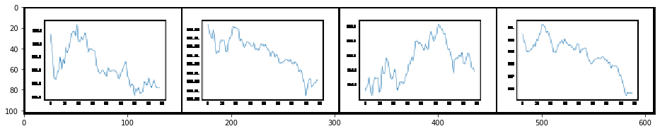
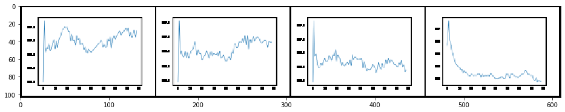
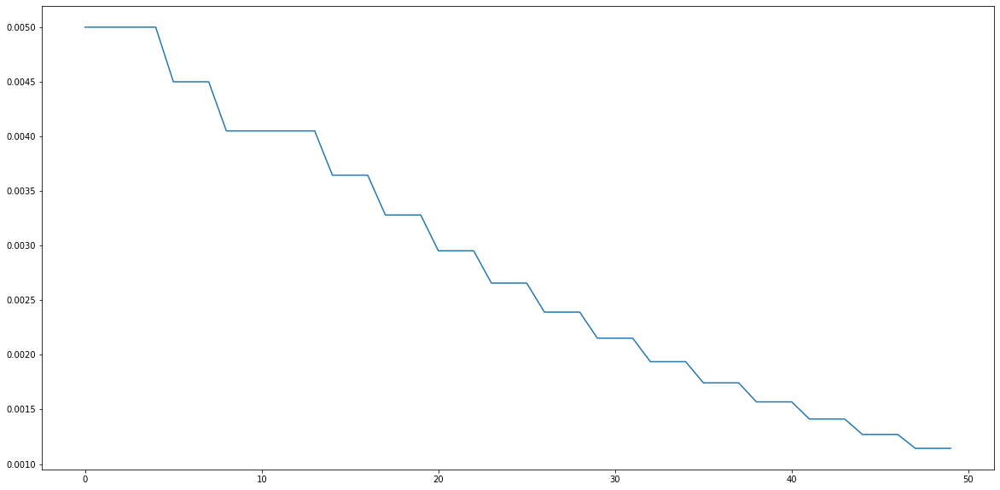
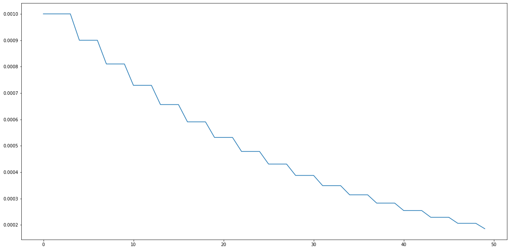
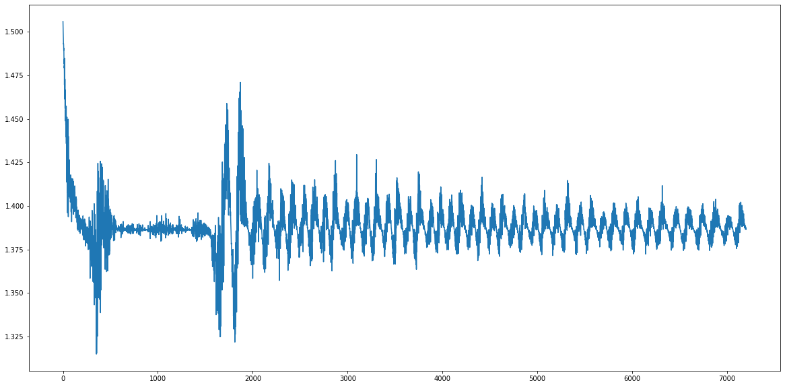
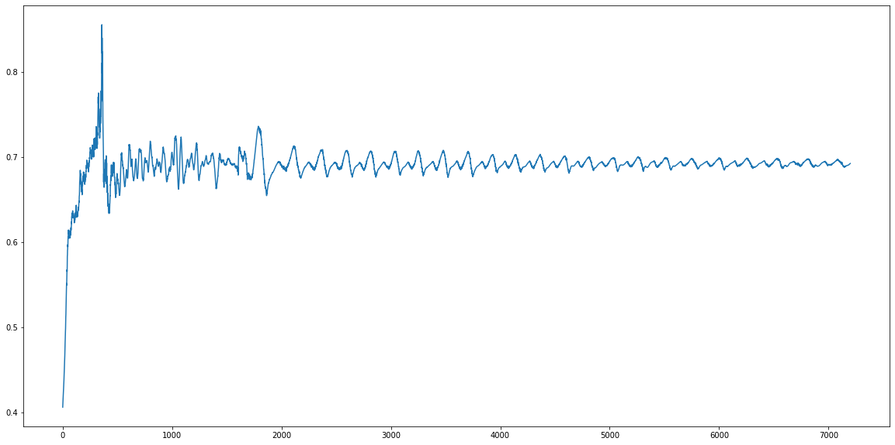
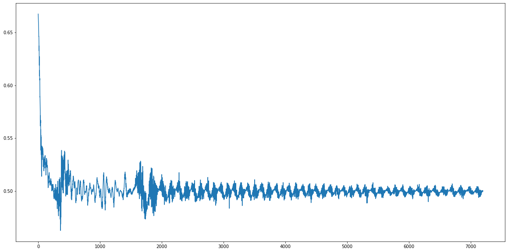
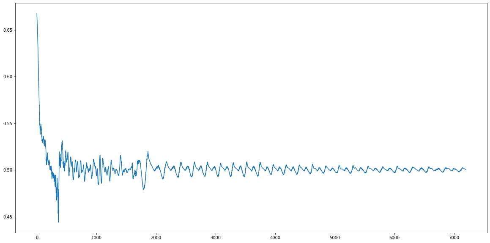
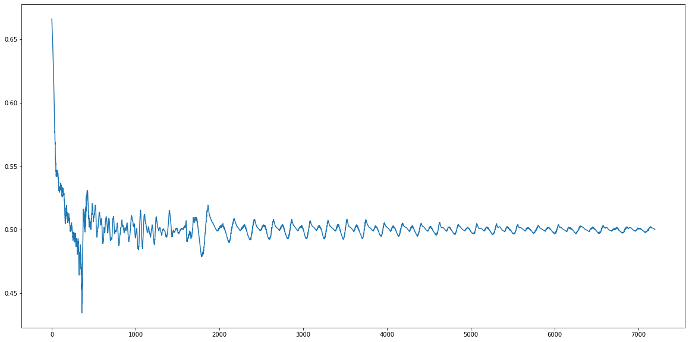
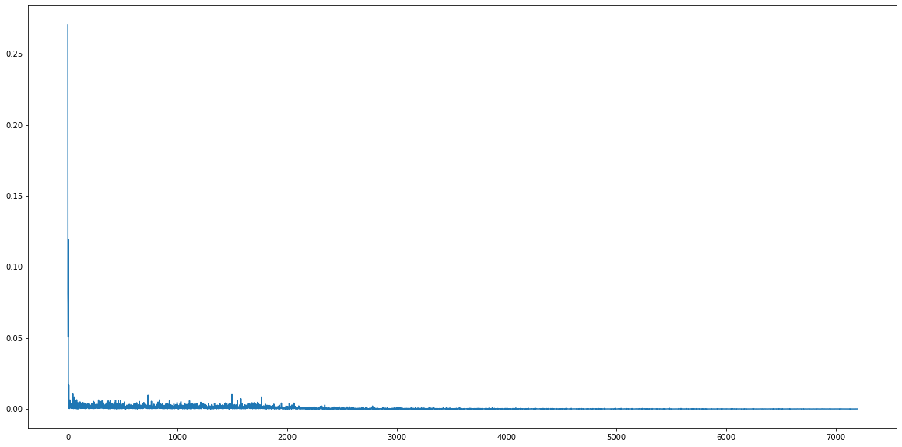

```python
import datetime
import os
import random
import matplotlib.pyplot as plt
import torchvision.transforms as transforms

import torch
import torch.nn as nn
import torch.backends.cudnn as cudnn
import torch.optim as optim
import torch.utils.data
import torchvision
from tensorboardX import SummaryWriter

from KospiDataset import KospiDataset
from Models import LSTMGenerator, CasualConvDiscriminator
from utils import time_series_to_plot
```


```python
run_name = datetime.datetime.now().strftime("%Y-%m-%d")
log_directory = os.path.join(os.getcwd(), run_name)
output_directory = log_directory
image_directory = os.path.join(log_directory, "images")
```


```python
random.seed(14)
torch.manual_seed(14)
```


    <torch._C.Generator at 0x18ea9651e50>


```python
writer = SummaryWriter(log_directory)
```


```python
cudnn.benchmark = True
device = torch.device("cpu")
```


```python
batch_size = 4
epochs = 50
delta_lambda = 10
```


```python
dataset = KospiDataset("C:\\Users\\parksinsik\\Desktop\\QuantGAN\\DATA\\kospi200.csv")
dataloader = torch.utils.data.DataLoader(dataset, batch_size=batch_size, shuffle=True, num_workers=1)
```


```python
seq_length = dataset[0].size(0)
```


```python
nz = 100
input_dim = nz + 1
```


```python
netG = LSTMGenerator(input_dim=input_dim, output_dim=1, hidden_dim=512, n_layers=2).to(device)
netD = CasualConvDiscriminator(input_size=1, n_layers=8, n_channel=1, kernel_size=2, dropout=0.3).to(device)
```


```python
criterion = nn.BCELoss().to(device)
delta_criterion = nn.MSELoss().to(device)
```


```python
fixed_noise = torch.randn(batch_size, seq_length, nz, device=device)
```


```python
deltas = dataset.sample_deltas(batch_size).unsqueeze(2).repeat(1, seq_length, 1)
fixed_noise = torch.cat((fixed_noise, deltas), dim=2)
```


```python
real_label, fake_label = 1, 0
```


```python
optimizerG = optim.RMSprop(netG.parameters(), lr=0.001)
optimizerD = optim.Adam(netD.parameters(), lr=0.005)
```


```python
schedulerG = optim.lr_scheduler.ReduceLROnPlateau(optimizerG, "min", patience=2, factor=0.9, min_lr=1e-4, verbose=False)
schedulerD = optim.lr_scheduler.ReduceLROnPlateau(optimizerD, "min", patience=2, factor=0.9, min_lr=5e-4, verbose=False)
```


```python
Lr_D_list = []
Lr_G_list = []
Loss_D_list = []
Loss_G_list = []
D_x_list = []
D_G_z1_list = []
D_G_z2_list = []
Delta_MSE_list = []
```


```python
for epoch in range(epochs):
    
    for i, data in enumerate(dataloader, 0):
        
        n_iter = epoch * len(dataloader) + i
        
        if i == 0:
            real_display = data.cpu()
            
        netD.zero_grad()
        real = data.to(device)
        batch_size, seq_length = real.size(0), real.size(1)
        label = torch.full((batch_size, seq_length, 1), real_label, device=device)
        
        output = netD(real)
        errD_real = criterion(output, label)
        errD_real.backward()
        
        D_x = output.mean().item()
        
        noise = torch.randn(batch_size, seq_length, nz, device=device)
        deltas = dataset.sample_deltas(batch_size).unsqueeze(2).repeat(1, seq_length, 1)
        noise = torch.cat((noise, deltas), dim=2)
        
        fake = netG(noise)
        label.fill_(fake_label)
        
        output = netD(fake.detach())
        errD_fake = criterion(output, label)
        errD_fake.backward()
        
        D_G_z1 = output.mean().item()
        errD = errD_real + errD_fake
        
        optimizerD.step()
        
        for name, param in netD.named_parameters():
            writer.add_histogram("Discriminator Gradients/{}".format(name), param.grad, n_iter)
            
        netG.zero_grad()
        
        label.fill_(real_label)
        
        output = netD(fake)
        errG = criterion(output, label)
        errG.backward()
        
        D_G_z2 = output.mean().item()
        
        optimizerG.step()
        
        netG.zero_grad()
        
        noise = torch.randn(batch_size, seq_length, nz, device=device)
        deltas = dataset.sample_deltas(batch_size).unsqueeze(2).repeat(1, seq_length, 1)
        noise = torch.cat((noise, deltas), dim=2)
        
        output_sequences = netG(noise)
        delta_loss = delta_lambda * delta_criterion(output_sequences[:, -1] - output_sequences[:, 0], deltas[:, 0])
        delta_loss.backward()
        
        optimizerG.step()
        
        for name, param in netG.named_parameters():
            writer.add_histogram("Generatortor Gradients/{}".format(name), param.grad, n_iter)
        
        writer.add_scalar("MSE of Deltas of Generated Sequences", delta_loss.item(), n_iter)
        
        Loss_D_list.append(errD.item())
        Loss_G_list.append(errG.item())
        D_x_list.append(D_x)
        D_G_z1_list.append(D_G_z1)
        D_G_z2_list.append(D_G_z2)
        Delta_MSE_list.append(delta_loss.item() / delta_lambda)
        
        writer.add_scalar("Discriminator Loss", errD.item(), n_iter)
        writer.add_scalar("Generator Loss", errG.item(), n_iter)
        writer.add_scalar("D of X", D_x, n_iter)
        writer.add_scalar("D of G of z", D_G_z1, n_iter)
        
    print("[%d/%d] \nLr_D: %.5f \nLr_G: %.5f \nLoss_D: %.4f \nLoss_G: %.4f \nD(x): %.4f \nD(G(z)): %.4f / %.4f"\
              % (epoch + 1, epochs, schedulerD.optimizer.param_groups[0]["lr"], schedulerG.optimizer.param_groups[0]["lr"], errD.item(), errG.item(), D_x, D_G_z1, D_G_z2), end="")
    print()
    print("Delta MSE: %.5f" % (delta_loss.item() / delta_lambda), end="")
    print("\n")
        
    real_plot = time_series_to_plot(dataset.denormalize(real_display))
    writer.add_image("Real", real_plot, epoch)
    
    fake = netG(fixed_noise)
    fake_plot = time_series_to_plot(dataset.denormalize(fake))
    
    # torchvision.utils.save_image(fake_plot, os.path.join(image_directory, "Epoch " + str(epoch + 1) + ".jpg"))
    
    writer.add_image("Fake", fake_plot, epoch)
    
    torch.save(netG, "%s_netG_epoch%d.pth" % (run_name, epoch + 1))
    torch.save(netD, "%s_netD_epoch%d.pth" % (run_name, epoch + 1))
    
    Lr_D_list.append(schedulerD.optimizer.param_groups[0]["lr"])
    schedulerD.step(float(errD))
    
    Lr_G_list.append(schedulerG.optimizer.param_groups[0]["lr"])
    schedulerG.step(float(errG))
```

    [1/50] 
    Lr_D: 0.00500 
    Lr_G: 0.00100 
    Loss_D: 1.3978 
    Loss_G: 0.6393 
    D(x): 0.5245 
    D(G(z)): 0.5282 / 0.5279
    Delta MSE: 0.00048
    
    [2/50] 
    Lr_D: 0.00500 
    Lr_G: 0.00100 
    Loss_D: 1.3843 
    Loss_G: 0.7217 
    D(x): 0.4979 
    D(G(z)): 0.4952 / 0.4870
    Delta MSE: 0.00051
    
    [3/50] 
    Lr_D: 0.00500 
    Lr_G: 0.00100 
    Loss_D: 1.3909 
    Loss_G: 0.6461 
    D(x): 0.5288 
    D(G(z)): 0.5282 / 0.5247
    Delta MSE: 0.00062
    
    [4/50] 
    Lr_D: 0.00500 
    Lr_G: 0.00100 
    Loss_D: 1.3868 
    Loss_G: 0.6749 
    D(x): 0.5102 
    D(G(z)): 0.5102 / 0.5092
    Delta MSE: 0.00065
    
    [5/50] 
    Lr_D: 0.00500 
    Lr_G: 0.00090 
    Loss_D: 1.3888 
    Loss_G: 0.7040 
    D(x): 0.4934 
    D(G(z)): 0.4945 / 0.4946
    Delta MSE: 0.00137
    
    [6/50] 
    Lr_D: 0.00450 
    Lr_G: 0.00090 
    Loss_D: 1.3876 
    Loss_G: 0.6975 
    D(x): 0.4968 
    D(G(z)): 0.4975 / 0.4978
    Delta MSE: 0.00327
    
    [7/50] 
    Lr_D: 0.00450 
    Lr_G: 0.00090 
    Loss_D: 1.3877 
    Loss_G: 0.6949 
    D(x): 0.4978 
    D(G(z)): 0.4985 / 0.4992
    Delta MSE: 0.00027
    
    [8/50] 
    Lr_D: 0.00450 
    Lr_G: 0.00081 
    Loss_D: 1.3864 
    Loss_G: 0.6916 
    D(x): 0.5002 
    D(G(z)): 0.5002 / 0.5008
    Delta MSE: 0.00333
    
    [9/50] 
    Lr_D: 0.00405 
    Lr_G: 0.00081 
    Loss_D: 1.3866 
    Loss_G: 0.6914 
    D(x): 0.5009 
    D(G(z)): 0.5010 / 0.5009
    Delta MSE: 0.00066
    
    [10/50] 
    Lr_D: 0.00405 
    Lr_G: 0.00081 
    Loss_D: 1.3835 
    Loss_G: 0.7033 
    D(x): 0.4957 
    D(G(z)): 0.4943 / 0.4950
    Delta MSE: 0.00439
    
    [11/50] 
    Lr_D: 0.00405 
    Lr_G: 0.00073 
    Loss_D: 1.3747 
    Loss_G: 0.6896 
    D(x): 0.5083 
    D(G(z)): 0.5023 / 0.5018
    Delta MSE: 0.00008
    
    [12/50] 
    Lr_D: 0.00405 
    Lr_G: 0.00073 
    Loss_D: 1.4461 
    Loss_G: 0.6774 
    D(x): 0.4792 
    D(G(z)): 0.5085 / 0.5079
    Delta MSE: 0.00048
    
    [13/50] 
    Lr_D: 0.00405 
    Lr_G: 0.00073 
    Loss_D: 1.4216 
    Loss_G: 0.6614 
    D(x): 0.4992 
    D(G(z)): 0.5166 / 0.5161
    Delta MSE: 0.00109
    
    [14/50] 
    Lr_D: 0.00405 
    Lr_G: 0.00066 
    Loss_D: 1.4027 
    Loss_G: 0.6881 
    D(x): 0.4946 
    D(G(z)): 0.5027 / 0.5026
    Delta MSE: 0.00059
    
    [15/50] 
    Lr_D: 0.00365 
    Lr_G: 0.00066 
    Loss_D: 1.4056 
    Loss_G: 0.6823 
    D(x): 0.4962 
    D(G(z)): 0.5056 / 0.5054
    Delta MSE: 0.00064
    
    [16/50] 
    Lr_D: 0.00365 
    Lr_G: 0.00066 
    Loss_D: 1.4021 
    Loss_G: 0.6868 
    D(x): 0.4956 
    D(G(z)): 0.5035 / 0.5032
    Delta MSE: 0.00048
    
    [17/50] 
    Lr_D: 0.00365 
    Lr_G: 0.00059 
    Loss_D: 1.3910 
    Loss_G: 0.6879 
    D(x): 0.5004 
    D(G(z)): 0.5028 / 0.5026
    Delta MSE: 0.00042
    
    [18/50] 
    Lr_D: 0.00328 
    Lr_G: 0.00059 
    Loss_D: 1.3772 
    Loss_G: 0.7079 
    D(x): 0.4974 
    D(G(z)): 0.4928 / 0.4927
    Delta MSE: 0.00096
    
    [19/50] 
    Lr_D: 0.00328 
    Lr_G: 0.00059 
    Loss_D: 1.3907 
    Loss_G: 0.6899 
    D(x): 0.4996 
    D(G(z)): 0.5017 / 0.5016
    Delta MSE: 0.00028
    
    [20/50] 
    Lr_D: 0.00328 
    Lr_G: 0.00053 
    Loss_D: 1.3897 
    Loss_G: 0.6844 
    D(x): 0.5029 
    D(G(z)): 0.5046 / 0.5044
    Delta MSE: 0.00025
    
    [21/50] 
    Lr_D: 0.00295 
    Lr_G: 0.00053 
    Loss_D: 1.3865 
    Loss_G: 0.7035 
    D(x): 0.4951 
    D(G(z)): 0.4951 / 0.4948
    Delta MSE: 0.00046
    
    [22/50] 
    Lr_D: 0.00295 
    Lr_G: 0.00053 
    Loss_D: 1.3823 
    Loss_G: 0.6925 
    D(x): 0.5025 
    D(G(z)): 0.5004 / 0.5003
    Delta MSE: 0.00004
    
    [23/50] 
    Lr_D: 0.00295 
    Lr_G: 0.00048 
    Loss_D: 1.3979 
    Loss_G: 0.6847 
    D(x): 0.4988 
    D(G(z)): 0.5045 / 0.5042
    Delta MSE: 0.00021
    
    [24/50] 
    Lr_D: 0.00266 
    Lr_G: 0.00048 
    Loss_D: 1.3916 
    Loss_G: 0.6997 
    D(x): 0.4944 
    D(G(z)): 0.4970 / 0.4967
    Delta MSE: 0.00004
    
    [25/50] 
    Lr_D: 0.00266 
    Lr_G: 0.00048 
    Loss_D: 1.3763 
    Loss_G: 0.6950 
    D(x): 0.5043 
    D(G(z)): 0.4992 / 0.4991
    Delta MSE: 0.00005
    
    [26/50] 
    Lr_D: 0.00266 
    Lr_G: 0.00043 
    Loss_D: 1.4017 
    Loss_G: 0.6823 
    D(x): 0.4980 
    D(G(z)): 0.5056 / 0.5054
    Delta MSE: 0.00010
    
    [27/50] 
    Lr_D: 0.00239 
    Lr_G: 0.00043 
    Loss_D: 1.3979 
    Loss_G: 0.6916 
    D(x): 0.4952 
    D(G(z)): 0.5010 / 0.5008
    Delta MSE: 0.00005
    
    [28/50] 
    Lr_D: 0.00239 
    Lr_G: 0.00043 
    Loss_D: 1.3785 
    Loss_G: 0.6932 
    D(x): 0.5040 
    D(G(z)): 0.5001 / 0.5000
    Delta MSE: 0.00003
    
    [29/50] 
    Lr_D: 0.00239 
    Lr_G: 0.00039 
    Loss_D: 1.3789 
    Loss_G: 0.6876 
    D(x): 0.5068 
    D(G(z)): 0.5030 / 0.5028
    Delta MSE: 0.00002
    
    [30/50] 
    Lr_D: 0.00215 
    Lr_G: 0.00039 
    Loss_D: 1.3924 
    Loss_G: 0.6912 
    D(x): 0.4982 
    D(G(z)): 0.5012 / 0.5010
    Delta MSE: 0.00005
    
    [31/50] 
    Lr_D: 0.00215 
    Lr_G: 0.00039 
    Loss_D: 1.3861 
    Loss_G: 0.6925 
    D(x): 0.5005 
    D(G(z)): 0.5004 / 0.5003
    Delta MSE: 0.00002
    
    [32/50] 
    Lr_D: 0.00215 
    Lr_G: 0.00035 
    Loss_D: 1.3909 
    Loss_G: 0.6958 
    D(x): 0.4964 
    D(G(z)): 0.4986 / 0.4987
    Delta MSE: 0.00005
    
    [33/50] 
    Lr_D: 0.00194 
    Lr_G: 0.00035 
    Loss_D: 1.3816 
    Loss_G: 0.6895 
    D(x): 0.5044 
    D(G(z)): 0.5020 / 0.5018
    Delta MSE: 0.00008
    
    [34/50] 
    Lr_D: 0.00194 
    Lr_G: 0.00035 
    Loss_D: 1.3877 
    Loss_G: 0.6915 
    D(x): 0.5002 
    D(G(z)): 0.5009 / 0.5008
    Delta MSE: 0.00010
    
    [35/50] 
    Lr_D: 0.00194 
    Lr_G: 0.00031 
    Loss_D: 1.3779 
    Loss_G: 0.6980 
    D(x): 0.5019 
    D(G(z)): 0.4977 / 0.4976
    Delta MSE: 0.00005
    
    [36/50] 
    Lr_D: 0.00174 
    Lr_G: 0.00031 
    Loss_D: 1.3927 
    Loss_G: 0.6904 
    D(x): 0.4984 
    D(G(z)): 0.5015 / 0.5014
    Delta MSE: 0.00009
    
    [37/50] 
    Lr_D: 0.00174 
    Lr_G: 0.00031 
    Loss_D: 1.4130 
    Loss_G: 0.6895 
    D(x): 0.4887 
    D(G(z)): 0.5019 / 0.5018
    Delta MSE: 0.00018
    
    [38/50] 
    Lr_D: 0.00174 
    Lr_G: 0.00028 
    Loss_D: 1.3922 
    Loss_G: 0.6929 
    D(x): 0.4973 
    D(G(z)): 0.5002 / 0.5001
    Delta MSE: 0.00007
    
    [39/50] 
    Lr_D: 0.00157 
    Lr_G: 0.00028 
    Loss_D: 1.3869 
    Loss_G: 0.6913 
    D(x): 0.5007 
    D(G(z)): 0.5010 / 0.5009
    Delta MSE: 0.00000
    
    [40/50] 
    Lr_D: 0.00157 
    Lr_G: 0.00028 
    Loss_D: 1.3760 
    Loss_G: 0.6979 
    D(x): 0.5028 
    D(G(z)): 0.4977 / 0.4976
    Delta MSE: 0.00010
    
    [41/50] 
    Lr_D: 0.00157 
    Lr_G: 0.00025 
    Loss_D: 1.3833 
    Loss_G: 0.6916 
    D(x): 0.5024 
    D(G(z)): 0.5009 / 0.5008
    Delta MSE: 0.00001
    
    [42/50] 
    Lr_D: 0.00141 
    Lr_G: 0.00025 
    Loss_D: 1.3886 
    Loss_G: 0.6867 
    D(x): 0.5023 
    D(G(z)): 0.5034 / 0.5032
    Delta MSE: 0.00019
    
    [43/50] 
    Lr_D: 0.00141 
    Lr_G: 0.00025 
    Loss_D: 1.3890 
    Loss_G: 0.6903 
    D(x): 0.5003 
    D(G(z)): 0.5016 / 0.5014
    Delta MSE: 0.00003
    
    [44/50] 
    Lr_D: 0.00141 
    Lr_G: 0.00023 
    Loss_D: 1.3898 
    Loss_G: 0.6889 
    D(x): 0.5004 
    D(G(z)): 0.5022 / 0.5021
    Delta MSE: 0.00002
    
    [45/50] 
    Lr_D: 0.00127 
    Lr_G: 0.00023 
    Loss_D: 1.3983 
    Loss_G: 0.6918 
    D(x): 0.4948 
    D(G(z)): 0.5008 / 0.5007
    Delta MSE: 0.00002
    
    [46/50] 
    Lr_D: 0.00127 
    Lr_G: 0.00023 
    Loss_D: 1.3925 
    Loss_G: 0.6893 
    D(x): 0.4988 
    D(G(z)): 0.5019 / 0.5019
    Delta MSE: 0.00007
    
    [47/50] 
    Lr_D: 0.00127 
    Lr_G: 0.00021 
    Loss_D: 1.3920 
    Loss_G: 0.6936 
    D(x): 0.4971 
    D(G(z)): 0.4999 / 0.4998
    Delta MSE: 0.00002
    
    [48/50] 
    Lr_D: 0.00114 
    Lr_G: 0.00021 
    Loss_D: 1.3913 
    Loss_G: 0.6898 
    D(x): 0.4992 
    D(G(z)): 0.5017 / 0.5017
    Delta MSE: 0.00001
    
    [49/50] 
    Lr_D: 0.00114 
    Lr_G: 0.00021 
    Loss_D: 1.3879 
    Loss_G: 0.6943 
    D(x): 0.4987 
    D(G(z)): 0.4995 / 0.4994
    Delta MSE: 0.00003
    
    [50/50] 
    Lr_D: 0.00114 
    Lr_G: 0.00019 
    Loss_D: 1.3865 
    Loss_G: 0.6927 
    D(x): 0.5002 
    D(G(z)): 0.5003 / 0.5002
    Delta MSE: 0.00003
    
    


```python
plt.figure(figsize=(16, 4))
plt.imshow(transforms.ToPILImage()(real_plot))
plt.show()
```





```python
plt.figure(figsize=(16, 4))
plt.imshow(transforms.ToPILImage()(fake_plot))
plt.show()
```





```python
plt.figure(figsize=(20, 10))
plt.plot(Lr_D_list)
```


    [<matplotlib.lines.Line2D at 0x18ecb796f60>]





```python
plt.figure(figsize=(20, 10))
plt.plot(Lr_G_list)
```


    [<matplotlib.lines.Line2D at 0x18ec94ba0b8>]





```python
plt.figure(figsize=(20, 10))
plt.plot(Loss_D_list)
```


    [<matplotlib.lines.Line2D at 0x18ec54a88d0>]





```python
plt.figure(figsize=(20, 10))
plt.plot(Loss_G_list)
```


    [<matplotlib.lines.Line2D at 0x18ebddfcb00>]





```python
plt.figure(figsize=(20, 10))
plt.plot(D_x_list)
```


    [<matplotlib.lines.Line2D at 0x18eaed5f828>]





```python
plt.figure(figsize=(20, 10))
plt.plot(D_G_z1_list)
```


    [<matplotlib.lines.Line2D at 0x18eb03aab70>]





```python
plt.figure(figsize=(20, 10))
plt.plot(D_G_z2_list)
```


    [<matplotlib.lines.Line2D at 0x18ec7196438>]





```python
plt.figure(figsize=(20, 10))
plt.plot(Delta_MSE_list)
```


    [<matplotlib.lines.Line2D at 0x18ecb18b3c8>]




